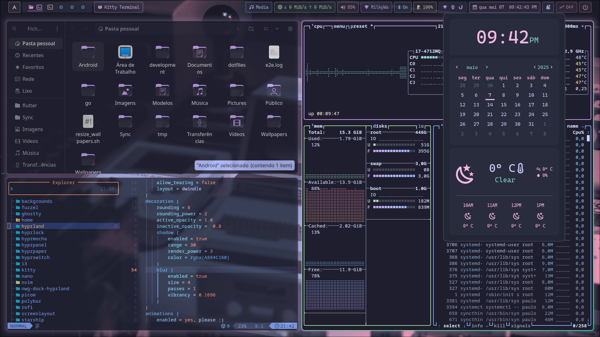

## Hyprland Dotfiles

These dotfiles are based on [Catpuccin](https://catppuccin.com/) theme with some modifications.

- [Catppuccin Gtk theme](https://github.com/catppuccin/gtk/releases)

   To set the theme I use ```nwg-look```

- Vimix Cursors ```sudo pacman -S vimix-cursors```


Some of the apps I use are: dunst, nautilus, rofi, ulauncher , hypridle, hyprlock, hyprshot.


#### Installation

```sudo pacman -S stow```

#### Example:
```bash
cd dotfiles
stow rofi
```

>The dotfiles have hidden files use ``ls -la`` or ```tree -a```


